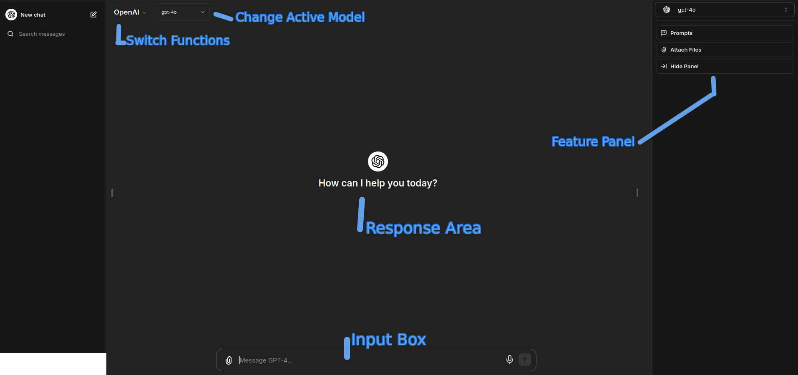

# Using ChatGPT-4

## Introduction

Welcome to the world of ChatGPT-4, an advanced language model developed by OpenAI that can generate human-like text based on the input it receives. Whether you're using it for writing assistance, research, or creative projects, this guide will help you get started and make the most of its capabilities.

## Getting Started

### Accessing ChatGPT on Arctik AI

1. **Create an Account:** Before you can start using ChatGPT-4, you need to create an Arctik AI Account (A third-party platform that integrates with ChatGPT).
2. **Login:** Once your account is set up, log in to access the interface where you can interact with ChatGPT-4.

### Interface Overview

Familiarize yourself with the interface:

- **Input Box:** This is where you type your prompts or questions.
- **Response Area:** This is where ChatGPT-4 will display its responses.
- **Feature Panel:** Change various settings depending on the mode you're in. Change between assistants, fine tune your responses from the model and more. 
- **Switch Functions:** Change between standard ChatGPT and Our Assistants.
- **Change Active Model:** Switch between the various ChatGPT Models (Please note, GPT-4o is the default and works best for most usage cases.)

## Using Prompts

### What is a Prompt?

!!! success

    **A prompt is the text you provide as input to ChatGPT-4. It could be a question, a command, or any other form of instruction.**

### Crafting Effective Prompts

1. **Be Clear and Specific:** The more specific your prompt, the better the response. For example, instead of asking “Tell me about history,” ask “Tell me about the causes of the American Civil War.”
2. **Set the Context:** Provide context to help guide the response. For example, “Write a formal email to a colleague about rescheduling a meeting.”
3. **Ask Follow-up Questions:** For more detailed information, you can ask follow-up questions based on the initial response.

### Examples of Effective Prompts

- “Explain the theory of relativity in simple terms.”
- “Write a short story about a dragon who learns to fly.”
- “Generate a list of creative blog post ideas about sustainable living.”
- “What are the best practices for remote work?”

## Useful Features

### Conversation History

Many platforms save your conversation history, allowing you to refer back to previous interactions. This can be helpful for ongoing projects or research.

### Adjusting Response Length

You can often adjust the desired length of the responses. If you need a brief summary, specify that in your prompt. For example, “Give me a brief overview of quantum mechanics.”

### Temperature Settings

Some platforms allow you to adjust the "temperature" of the responses. A lower temperature (e.g., 0.2) makes the output more deterministic and focused, while a higher temperature (e.g., 0.8) makes it more random and creative.

## Do’s and Don’ts

### Do’s

1. **Do Experiment:** Try different types of prompts to see how ChatGPT-4 responds. This will help you understand its capabilities and limitations.
2. **Do Use Clear Language:** Simple and clear language improves response accuracy.
3. **Do Provide Feedback:** If the platform has a feedback feature, use it to help improve the model.

### Don’ts

1. **Don’t Share Sensitive Information:** Avoid sharing personal, financial, or sensitive information in your prompts.
2. **Don’t Expect Perfection:** While ChatGPT-4 is powerful, it’s not perfect. Always verify critical information from reliable sources.
3. **Don’t Use for Harmful Purposes:** Do not use ChatGPT-4 to generate harmful, malicious, or inappropriate content.

## Additional Helpful Information

### Dealing with Errors

If the response is not what you expected, try:
- Rephrasing the prompt.
- Providing more context.
- Asking a follow-up question.

### Staying Updated

Check for updates and new features provided by the platform. AI models like ChatGPT-4 are continually being improved.

### Ethical Use

Always use ChatGPT-4 ethically. Respect copyright laws and other intellectual property rights. Avoid generating harmful or misleading content.

### Learning Resources

- **OpenAI Documentation:** Visit the OpenAI documentation and guides for more detailed information.
- **Forums and Communities:** Engage with other users in forums or online communities to share tips and experiences.

---